# behaviourtree.lua

- require "class"

self

- require "abstract/behaviour-tree"

<docs-expose>

behaviour tree

有两种基本状态:

- @SUCCESS
- @FAILED

为了游戏不阻塞而设计的:

- @RUNNING

了解概念可以参考 #abstract/behaviour-tree

```mermaid
classDiagram

  class BT ["@BT"] {
    inst
    root
    _ctor@BT-_ctor(inst, root)
    ForceUpdate@BT-ForceUpdate()
    Update@BT-Update()
    Reset@BT-Reset()
    Stop@BT-Stop()
    GetSleepTime@BT-GetSleepTime()
    __tostring@BT-__tostring()
  }
  class BehaviourNode ["@BehaviourNode"] {
    name
    children
    status
    lastresult
    nextupdatetick
    id
    _ctor@BehaviourNode-_ctor(name, children)
    DoToParents@BehaviourNode-DoToParents(fn)
    GetTreeString@BehaviourNode-GetTreeString(indent)
    DBString@BehaviourNode-DBString()
    Sleep@BehaviourNode-Sleep(t)
    GetSleepTime@BehaviourNode-GetSleepTime()
    GetTreeSleepTime@BehaviourNode-GetTreeSleepTime()
    GetString@BehaviourNode-GetString()
    Visit@BehaviourNode-Visit()
    SaveStatus@BehaviourNode-SaveStatus()
    Step@BehaviourNode-Step()
    Reset@BehaviourNode-Reset()
    Stop@BehaviourNode-Stop()
  }
  class DecoratorNode ["@DecoratorNode"] {

    _ctor@DecoratorNode-_ctor(name, child)

  }
  class ConditionNode ["@ConditionNode"] {
    fn
    _ctor@ConditionNode-_ctor(fn, name)
    Visit@ConditionNode-Visit()
  }
  class MultiConditionNode ["@MultiConditionNode"] {
    start
    continue
    _ctor@MultiConditionNode-_ctor(start, continue, name)
    Visit@MultiConditionNode-Visit()
  }
  class ConditionWaitNode ["@ConditionWaitNode"] {
    fn
    _ctor@ConditionWaitNode-_ctor(fn, name)
    Visit@ConditionWaitNode-Visit()
  }
  class ActionNode ["@ActionNode"] {
    action
    _ctor@ActionNode-_ctor(action, name)
    Visit@ActionNode-Visit()
  }
  class WaitNode ["@WaitNode"] {
    wait_time
    _ctor@WaitNode-_ctor(time)
    DBString@WaitNode-DBString()
    Visit@WaitNode-Visit()
  }
  class SequenceNode ["@SequenceNode"] {
    idx
    _ctor@SequenceNode-_ctor(children)
    DBString@SequenceNode-DBString()
    Reset@SequenceNode-Reset()
    Visit@SequenceNode-Visit()
  }
  class SelectorNode ["@SelectorNode"] {
    idx
    _ctor@SelectorNode-_ctor(children)
    DBString@SelectorNode-DBString()
    Reset@SelectorNode-Reset()
    Visit@SelectorNode-Visit()
  }
  class NotDecorator ["@NotDecorator"] {

    _ctor@NotDecorator-_ctor(child)
    Visit@NotDecorator-Visit()
  }
  class FailIfRunningDecorator ["@FailIfRunningDecorator"] {

    _ctor@FailIfRunningDecorator-_ctor(child)
    Visit@FailIfRunningDecorator-Visit()
  }
  class FailIfSuccessDecorator ["@FailIfSuccessDecorator"] {

    _ctor@FailIfSuccessDecorator-_ctor(child)
    Visit@FailIfSuccessDecorator-Visit()
  }
  class LoopNode ["@LoopNode"] {
    idx
    maxreps
    rep
    _ctor@LoopNode-_ctor(children, maxreps)
    DBString@LoopNode-DBString()
    Reset@LoopNode-Reset()
    Visit@LoopNode-Visit()
  }
  class RandomNode ["@RandomNode"] {

    _ctor@RandomNode-_ctor(children)
    Reset@RandomNode-Reset()
    Visit@RandomNode-Visit()
  }
  class PriorityNode ["@PriorityNode"] {
    period
    _ctor@PriorityNode-_ctor(children, period, noscatter)
    GetSleepTime@PriorityNode-GetSleepTime()
    DBString@PriorityNode-DBString()
    Reset@PriorityNode-Reset()
    Visit@PriorityNode-Visit()
  }
  class ParallelNode ["@ParallelNode"] {

    _ctor@ParallelNode-_ctor(children, name)
    Step@ParallelNode-Step()
    Visit@ParallelNode-Visit()
  }
  class ParallelNodeAny ["@ParallelNodeAny"] {
    stoponanycomplete
    _ctor@ParallelNodeAny-_ctor(children)

  }
  class EventNode ["@EventNode"] {
    inst
    event
    priority
    eventfn
    _ctor@EventNode-_ctor(inst, event, child, priority)
    OnStop@EventNode-OnStop()
    OnEvent@EventNode-OnEvent(data)
    Step@EventNode-Step()
    Reset@EventNode-Reset()
    Visit@EventNode-Visit()
  }
  class LatchNode ["@LatchNode"] {
    inst
    latchduration
    currentlatchduration
    lastlatchtime
    _ctor@LatchNode-_ctor(inst, latchduration, child)
    Visit@LatchNode-Visit()
  }


  DecoratorNode --|> BehaviourNode
  ConditionNode --|> BehaviourNode
  MultiConditionNode --|> BehaviourNode
  ConditionWaitNode --|> BehaviourNode
  ActionNode --|> BehaviourNode
  WaitNode --|> BehaviourNode
  SequenceNode --|> BehaviourNode
  SelectorNode --|> BehaviourNode
  NotDecorator --|> DecoratorNode
  FailIfRunningDecorator --|> DecoratorNode
  FailIfSuccessDecorator --|> DecoratorNode
  LoopNode --|> BehaviourNode
  RandomNode --|> BehaviourNode
  PriorityNode --|> BehaviourNode
  ParallelNode --|> BehaviourNode
  ParallelNodeAny --|> ParallelNode
  EventNode --|> BehaviourNode
  LatchNode --|> BehaviourNode
```

</docs-expose>



## SUCCESS

<docs-expose>

SUCCESS = @BehaviourNodeStatus

```lua
SUCCESS = "SUCCESS"
```

</docs-expose>

## FAILED

<docs-expose>

FAILED = @BehaviourNodeStatus

```lua
FAILED = "FAILED"
```

</docs-expose>

## READY

<docs-expose>

READY = @BehaviourNodeStatus

```lua
READY = "READY"
```

</docs-expose>

## RUNNING

<docs-expose>

RUNNING = @BehaviourNodeStatus

```lua
RUNNING = "RUNNING"
```

</docs-expose>

## BT

<docs-expose>

BT = inst, root

behaviour tree

</docs-expose>

## BT-ForceUpdate

<docs-expose>

() => ()

实际上, 设置内部状态为 forceupdate = true

</docs-expose>

## BT-Update

<docs-expose>

() => ()

行为树更新状态

相当于: g_player->btexec()是在游戏的更新函数（update 或 tick）里，需要每帧调用(https://www.behaviac.com/language/zh/concepts/)

</docs-expose>

1. root @Visit
2. root @BehaviourNode-SaveStatus
3. root @BehaviourNode-Step
4. forceupdate = false

## BT-Reset

<docs-expose>

() => ()

重置 @BT

委托 root @BehaviourNode-Reset

</docs-expose>

## BT-Stop

<docs-expose>

() => ()

委托 root @BehaviourNode-Stop

</docs-expose>

## BT-GetSleepTime

<docs-expose>

() => Number

委托 root @BehaviourNode-GetSleepTime

</docs-expose>

## BehaviourNode

<docs-expose>

BehaviourNode = name: string, children: [ @BehaviourNode ]

BehaviourNode:

- name
- children
- status: @BehaviourNodeStatus = @READY
- lastresult: @BehaviourNodeStatus = @READY
- parent: @BehaviourNode
- id: Number, 用于分配 imgui

</docs-expose>

## BehaviourNode-DoToParents

<docs-expose>

fn => ()

- fn: (node: @BehaviourNode => ())

对所有的 parents 执行 fn

</docs-expose>

## BehaviourNode-Sleep

<docs-expose>

t => ()

实际上是修改更新的时间 self.nextupdatetime

</docs-expose>

## BehaviourNode-GetSleepTime

<docs-expose>

() => ()

正在执行的 @ActionNode 才有 sleep time

</docs-expose>

就是用 nextupdatetime - GetTime()

## BehaviourNode-GetTreeSleepTime

<docs-expose>

() => ()

实际上就是计算最底层所有子节点中最大的 sleep time

</docs-expose>

分两种考虑:

- @ActionNode:

  委托 @BehaviourNode-GetSleepTime

- 其他:

  获取所有子节点的 @BehaviourNode-GetTreeSleepTime

  选取时间最大的那个

## BehaviourNode-Visit

<docs-expose>

() => ()

将当前节点 status 设为 FAILED

</docs-expose>

## BehaviourNode-SaveStatus

<docs-expose>

() => ()

将自己和所有子节点的状态保留进入 lastresult

</docs-expose>

## BehaviourNode-Step

<docs-expose>

() => ()

- not @RUNNING, 则重置节点状态
- @RUNNING, 则调用子节点 @BehaviourNode-Step 进行递归

</docs-expose>

## BehaviourNode-Reset

<docs-expose>

() => ()

将当前节点和所有子节点设置为 READY

</docs-expose>

## BehaviourNode-Stop

<docs-expose>

() => ()

停止当前及其所有子节点

</docs-expose>

有 OnStop 监听

## DecoratorNode

<docs-expose>

DecoratorNode = (name = "Decorator", child: @BehaviourNode) extends @BehaviourNode

</docs-expose>

## ConditionNode

<docs-expose>

ConditionNode = (fn, name = "Condition") extends @BehaviourNode

class:

- fn: () => (), 挂载条件

</docs-expose>

## ConditionNode-Visit

<docs-expose>

() => Boolean

self.fn() 成功则返回 @SUCCESS, 否则返回 @FAILED

</docs-expose>

## MultiConditionNode

<docs-expose>

MultiConditionNode = (start, continue, name = "Condition") extends @BehaviourNode

- start
- continue

</docs-expose>

## MultiConditionNode-Visit

<docs-expose>

() => ()

</docs-expose>

## ConditionWaitNode

<docs-expose>

ConditionWaitNode = (fn, name = "Wait") extends @BehaviourNode

- fn: () => Boolean, 挂载条件

</docs-expose>

## ConditionWaitNode-Visit

<docs-expose>

() => ()

self.fn() 成功则返回 @SUCCESS, 否则返回 @RUNNING

</docs-expose>

## ActionNode

<docs-expose>

ActionNode = (action, name = "ActionNode") extends @BehaviourNode

- action: 挂载动作

</docs-expose>

## ActionNode-Visit

<docs-expose>

执行完动作返回 @SUCCESS

</docs-expose>

## WaitNode

<docs-expose>

WaitNode = (time, time) extends @BehaviourNode

- self.name = "Wait"
- self.wait_time = time

</docs-expose>

## WaitNode-Visit

<docs-expose>

() => ()

- not @RUNNING, 则变成@RUNNING, 并且设置 self.wake_time
- @RUNNING, self.wake_time 超过当前时间则返回成功, 没有则 @BehaviourNode-Sleep

</docs-expose>

## SequenceNode

<docs-expose>

SequenceNode = (children: [ @BehaviourNode ]) extends @BehaviourNode

- self.name = "Sequence"
- self.idx = 1 : 内部指针

相当于 and 容器

</docs-expose>

## SequenceNode-Reset

<docs-expose>

() => ()

1. @BehaviourNode-Reset
2. 内部指针归位

</docs-expose>

## SequenceNode-Visit

<docs-expose>

() => ()

依次遍历 children, 实现 and 逻辑

遇到 @FAILED, 则返回 @FAILED

遇到 @RUNNING, 则返回 @RUNNING, 这是为了不阻塞

</docs-expose>

## SelectorNode

<docs-expose>

SelectorNode = (children: [ @BehaviourNode ]) extends @BehaviourNode

- self.name = "Selector"
- self.idx = 1 : 内部指针

</docs-expose>

## SelectorNode-Reset

<docs-expose>

() => ()

同 @SequenceNode-Reset

1. @BehaviourNode-Reset
2. 内部指针归位

实现 or 逻辑

</docs-expose>

## SelectorNode-Visit

<docs-expose>

() => ()

依次遍历 children, 实现 or 逻辑

遇到 @SUCCESS, 则返回 @SUCCESS

遇到 @RUNNING, 则返回 @RUNNING, 这是为了不阻塞

</docs-expose>

## NotDecorator

<docs-expose>

NotDecorator = (child: @BehaviourNode) extends @DecoratorNode

- self.name = "Not"

实现 not 逻辑

</docs-expose>

## NotDecorator-Visit

<docs-expose>

() => ()

将 @SUCCESS, @FAILED 取反, 其他委托返回

</docs-expose>

## FailIfRunningDecorator

<docs-expose>

FailIfRunningDecorator = (child: @BehaviourNode) extends @DecoratorNode

- self.name = "FailIfRunning"

@RUNNING, 返回 @FAILED

</docs-expose>

## FailIfRunningDecorator-Visit

<docs-expose>

() => ()

@RUNNING, 返回 @FAILED, 其他委托返回

</docs-expose>

## LoopNode

<docs-expose>

LoopNode = (children: [ @BehaviourNode ], maxreps) extends @BehaviourNode

- self.name = "Sequence"

相当于将 @SequenceNode 重复 maxreps 次

</docs-expose>

## LoopNode-Reset

<docs-expose>

() => ()

reset

</docs-expose>

## LoopNode-Visit

<docs-expose>

() => ()

每次 visit 只会执行一次, 查过 maxreps 则返回 @SUCCESS

</docs-expose>

## RandomNode

<docs-expose>

RandomNode = (children: [ @BehaviourNode ]) extends @BehaviourNode

- self.name = "Random"

随机选择 @SUCCESS or @RUNNING 的子节点

</docs-expose>

## RandomNode-Reset

<docs-expose>

() => () override

</docs-expose>

## RandomNode-Visit

<docs-expose>

() => ()

在 READY 的时候随机选择一个子节点, 失败则选择下一个, 直到 @SUCCESS or @RUNNING. 否则, 返回 @FAILED

</docs-expose>

## PriorityNode

<docs-expose>

PriorityNode = (children: [ @BehaviourNode ], period = 1, noscatter: Boolean) extends @BehaviourNode

- period: 检测间隔
- self.lasttime: 上次时间, 随机初始化

一般作为根节点, 也可以作为 @SequenceNode 使用. 可以设置独立的检测时间间隔, 但不可以高于根节点的间隔, 否则根节点会先刷新

</docs-expose>

## PriorityNode-GetSleepTime

<docs-expose>

() => Number

self.lasttime + self.period - GetTime()

</docs-expose>

## PriorityNode-Reset

<docs-expose>

() => () override

</docs-expose>

## PriorityNode-Visit

<docs-expose>

() => ()

优先级节点的行为, 记录节点上次访问时间, 判断是否需要重新评估子节点等操作.如果所有子节点都执行失败, 则该节点状态为 FAILED

</docs-expose>

- 需要重新评估

  1. 更新 lasttime = GetTime()
  2. 遍历子节点
     1. 重置 @SUCCESS / @FAILED 的子节点
     2. 重新 visit 子节点
     3. 节点状态为 @RUNNING or @FAILED 则说明找到

- 不需要重新评估: 执行正在 RUNNING 的子节点, 获得返回结果. 如果状态不是 RUNNING 了, 则进入重新评估状态

## ParallelNode

<docs-expose>

ParallelNode = (children: [ @BehaviourNode ], name = "Parallel") extends @BehaviourNode

</docs-expose>

## ParallelNode-Step

<docs-expose>

() => ()

- not @RUNNING, 则 Reset
- @RUNNING, 将 @SUCCESS 的 @ConditionNode 进行 Reset

</docs-expose>

## ParallelNode-Visit

<docs-expose>

() => ()

TODO

</docs-expose>

## ParallelNodeAny

<docs-expose>

ParallelNodeAny = (children: [ @BehaviourNode ], name = "Parallel(Any)") extends @ParallelNode

- self.stoponanycomplete = true

</docs-expose>

## EventNode

<docs-expose>

EventNode = (inst, event, child: @BehaviourNode, priority: Number) extends @BehaviourNode

- self.name = "Event(${event})"
- self.eventfn: (inst, data) => self:OnEvent(data)
- inst 监听 event

</docs-expose>

## EventNode-OnStop

<docs-expose>

() => ()

移除监听

</docs-expose>

## EventNode-OnEvent

<docs-expose>

(data) => ()

1. 中断子节点
2. 强制更新 @Brain
3. 唤醒父节点 @PriorityNode

</docs-expose>

## EventNode-Step

<docs-expose>

() => () override

</docs-expose>

## EventNode-Reset

<docs-expose>

() => () override

</docs-expose>

## EventNode-Visit

<docs-expose>

() => ()

执行子节点

</docs-expose>

## WhileNode

<docs-expose>

cond: fn, name, node: @BehaviourNode => @ParallelNode ( @ConditionNode, @BehaviourNode )

</docs-expose>

## IfNode

<docs-expose>

cond: fn, name, node: @BehaviourNode => @SequenceNode ( @ConditionNode, @BehaviourNode )

</docs-expose>

## IfThenDoWhileNode

<docs-expose>

ifcond, whilecond, name, node: @BehaviourNode => @ParallelNode ( @MultiConditionNode, @BehaviourNode )

</docs-expose>

## LatchNode

<docs-expose>

LatchNode = (inst, latchduration, child: @BehaviourNode) extends @BehaviourNode

- self.name = "Latch(${latchduration})"

</docs-expose>

## LatchNode-Visit

<docs-expose>

TODO

</docs-expose>

## local

### profilewrapvisit

<docs-expose>

node: @BehaviourNode => ()

decorate 所有 node 的 @BehaviourNode-Visit

</docs-expose>

被 TheSim (类似于 stack) push 名字
