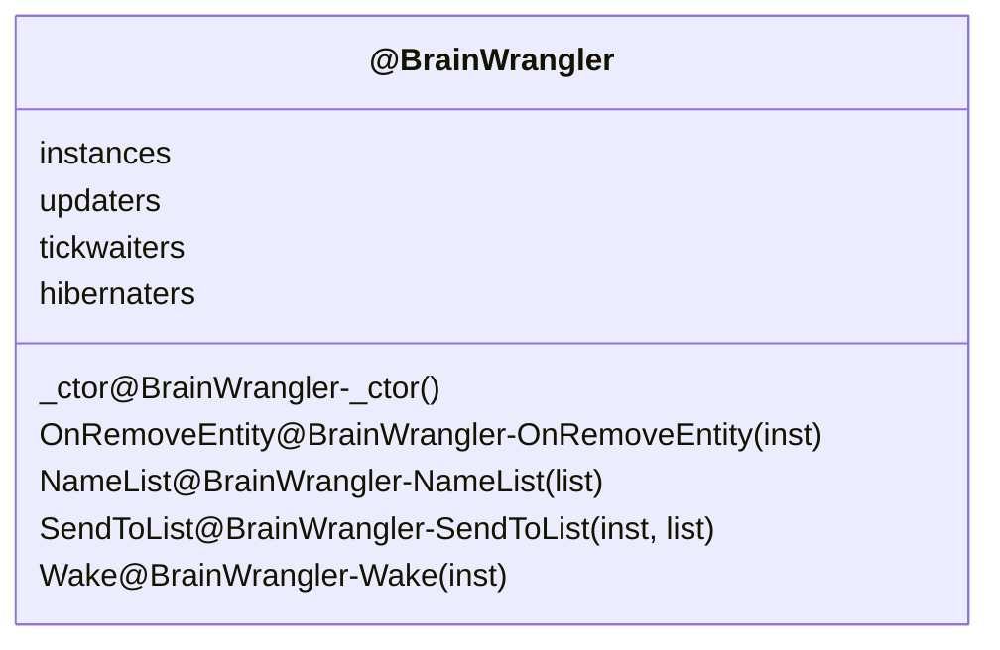

# brain.lua

docs:

- require "class"

<docs-expose>

brain 的基础设计

</docs-expose>

## BrainWrangler

<docs-expose>

Wrangler: 牧马人

- instances
- updaters
- tickwaiters
- hibernaters

</docs-expose>

## BrainWrangler-\_ctor

<docs-expose>

()

</docs-expose>

## BrainManager

<docs-expose>

BrainManager = BrainWrangler()

</docs-expose>

## BrainWrangler-OnRemoveEntity

<docs-expose>

inst => ()

移除 inst.brain

</docs-expose>

## BrainWrangler-NameList

<docs-expose>

list => string

- nil -> "nil"
- ...

</docs-expose>

## BrainWrangler-SendToList

<docs-expose>

inst: key, list: table => ()

- inst: brain 名字
- list:

</docs-expose>

## BrainWrangler-Wake

<docs-expose>

inst => ()

</docs-expose>

## BrainWrangler-Hibernate
