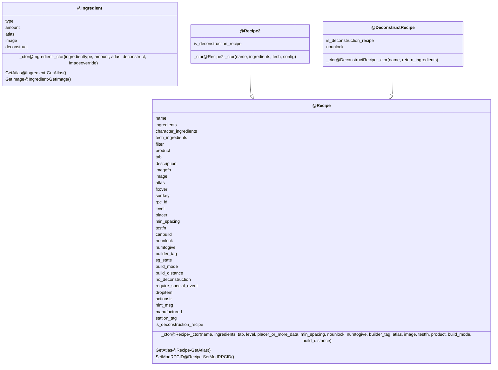

# recipe.lua

```mermaid
classDiagram

  class Ingredient ["@Ingredient"] {
    type
    amount
    atlas
    image
    deconstruct
    _ctor@Ingredient-_ctor(ingredienttype, amount, atlas, deconstruct, imageoverride)
    GetAtlas@Ingredient-GetAtlas()
    GetImage@Ingredient-GetImage()
  }
  class Recipe ["@Recipe"] {
    name
    ingredients
    character_ingredients
    tech_ingredients
    filter
    product
    tab
    description
    imagefn
    image
    atlas
    fxover
    sortkey
    rpc_id
    level
    placer
    min_spacing
    testfn
    canbuild
    nounlock
    numtogive
    builder_tag
    sg_state
    build_mode
    build_distance
    no_deconstruction
    require_special_event
    dropitem
    actionstr
    hint_msg
    manufactured
    station_tag
    is_deconstruction_recipe
    _ctor@Recipe-_ctor(name, ingredients, tab, level, placer_or_more_data, min_spacing, nounlock, numtogive, builder_tag, atlas, image, testfn, product, build_mode, build_distance)
    GetAtlas@Recipe-GetAtlas()
    SetModRPCID@Recipe-SetModRPCID()
  }
  class Recipe2 ["@Recipe2"] {
    is_deconstruction_recipe
    _ctor@Recipe2-_ctor(name, ingredients, tech, config)

  }
  class DeconstructRecipe ["@DeconstructRecipe"] {
    is_deconstruction_recipe
    nounlock
    _ctor@DeconstructRecipe-_ctor(name, return_ingredients)

  }


  Recipe2 --|> Recipe
  DeconstructRecipe --|> Recipe
```
